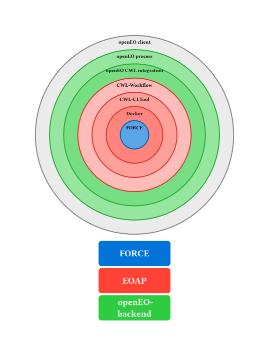

# FORCE as an Earth Observation Application Package, integrated into CDSE openEO

Run the [FORCE processing engine](https://force-eo.readthedocs.io/en/latest/) on the
[Copernicus Dataspace Ecosystem](https://dataspace.copernicus.eu/)'s (CDSE) openEO service, or deploy
FORCE as an Application package according to the
[OGC Best Practice for Earth Observation Application Package](http://www.opengis.net/doc/BP/eoap/1.0) (EOAP) on a
compatible service.

FORCE (Framework for Operational Radiometric Correction for Environmental Monitoring) is a processing framework
for Sentinel-2 and Landsat imagery. It supports the generation of Analysis Ready Data Cubes (level 2 processing) and
many higher level processing operations such as time series analysis.
[FORCE is developed](https://github.com/davidfrantz/force) by Prof. David Frantz
(*Geoinformatics - Spatial Data Science*, Trier University) and the FORCE Open Source community.
Please make sure to [acknowledge their work accordingly](https://force-eo.readthedocs.io/en/latest/policy/citation.html)
when processing with FORCE.

This repository wraps FORCE as an EOAP and adds tools necessary for integrating it into cloud services.
In particular, FORCE is made available as an openEO process in the CDSE openEO backend.

The cloud integration of FORCE has been performed in the context of the [European Space Agency](https://www.esa.int/)'s
(ESA) [Application Propagation Environments](https://apex.esa.int/) (APEx) initiative.

For more information, have a look at [the documentation](https://esa-apex.github.io/apex_toolbox_documentation/docs/force/)
(on the [APEx toolbox documentation portal](https://esa-apex.github.io/apex_toolbox_documentation).

## Features

- FORCE level 2 processing through openEO on CDSE
- FORCE Time Series Analysis (TSA) through openEO on CDSE
- Automatic STAC generation for FORCE datacubes
- Discover parameters of cloudified FORCE modules using the openEO client
- Run level 2 processing once and re-use results without downloading multiple times
- Area of interest selection (level 2) with GEOJSON: parameter aoi of force_level2.
- Automatic DEM download based on selected area
- Integration with openEO workspaces to share results

STAC generation can be applied to any FORCE (level2 or TSA) data cubes, not just those produced by this EOAP.

## Getting Started

- Read the FORCE [user guide](https://esa-apex.github.io/apex_toolbox_documentation/docs/force/guide/intro.html)
  in the offical APEx toolbox documentation portal

### Examples

For more detailed examples and more context, see
[the user guide](https://esa-apex.github.io/apex_toolbox_documentation/docs/force/guide/intro.html) and the
[example notebooks](examples).

You will need a (free) [CDSE account](https://dataspace.copernicus.eu/) to run this example, as well as the
[openEO Python client installed](https://open-eo.github.io/openeo-python-client/installation.html).

```Python
import openeo
from openeo.rest.stac_resource import StacResource
from openeo.internal.graph_building import PGNode


connection = openeo.connect("openeo.dataspace.copernicus.eu").authenticate_oidc()


# Select a STAC item to process (collections, catalogs and item collections are also supported!)
stac_item_url = "https://stac.dataspace.copernicus.eu/v1/collections/sentinel-2-l1c/items/S2A_MSIL1C_20260419T100711_N0512_R022_T32TPQ_20260419T152521"

# Create the process graph
processing_name = "FORCE_level2"
force_l2_stac_resource = StacResource(
    graph=PGNode(
        process_id="force_level2",
        arguments={
            "stac_url": stac_item_url,
            "name": processing_name,
            "do_brdf": True,
            # other FORCE level 2 parameters
        },
    ),
    connection=connection,
)

# Run processing
l2_job = force_l2_stac_resource.create_job(title=processing_name)
l2_job.start_and_wait()

# Download results (alternatively: Continue processing without download with Time Series Analysis. Check out the guide!)

l2_results = l2_job.get_results()
l2_results.download_files("force-level2-results")
```

## Structure



## Related

- [FORCE](https://force-eo.readthedocs.io/en/latest/) Framework for Operational Radiometric Correction for Environmental
  monitoring, the processing engine wrapped by the EOAP implemented in this repository
- [Application Propagation Environments (APEx)](https://apex.esa.int/): ESA initiative to provide easy access to
  earth observation application outcomes. FORCE was provided as a cloud-ready toolbox through the
  [APEx *Toolbox Cloudification* activity](https://esa-apex.github.io/apex_documentation/propagation/toolboxcloud.html)
- [EOAP best practice](http://www.opengis.net/doc/BP/eoap/1.0) The *OGC Best Practice for Earth Observation Application Package*
  a specification how to provide earth observation processors in a standardized format. This repository provides FORCE
  in a accordance with this best practice.