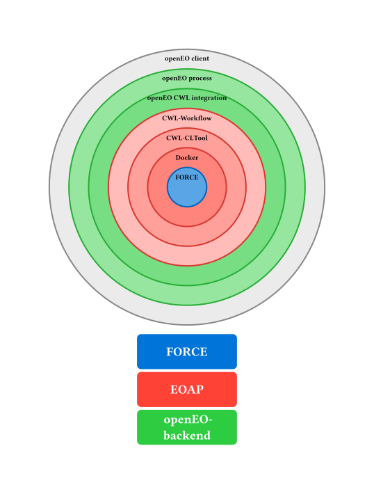

The integration of the [FORCE](https://force-eo.readthedocs.io/en/latest/) processing engine in CDSE provides access to [a subset of FORCE's processing functionality](feature_overview.qmd) via the [openEO API on CDSE](https://eoap.github.io/).

The integrated FORCE can be used to process on cloud infrastructure using an openEO client ([Python](https://open-eo.github.io/openeo-python-client/), [R](https://open-eo.github.io/openeo-r-client/) or [Javascript](https://open-eo.github.io/openeo-js-client/latest/)) and the openEO web-interface to create and monitor jobs.
Input Staging and [SpatioTemporal Asset Catalog (STAC)](https://stacspec.org/en) generation are handled automatically.

The integration has been performed by [Brockmann Consult GmbH](https://www.brockmann-consult.de/) in the context of the European Space Agency's (ESA) [*Application Propagation Environments* (APEx)](https://apex.esa.int/) initiative.

## FORCE

](https://force-eo.readthedocs.io/en/latest/_images/force.png)

FORCE (Framework for Operational Radiometric Correction for Environmental Monitoring) is an EO processing engine developed by [Prof. Dr. David Frantz](https://www.uni-trier.de/universitaet/fachbereiche-faecher/fachbereich-vi/faecher/geoinformatik/team/prof-dr-d-frantz)
(*Geoinformatics - Spatial Data Science*, Trier University).

FORCE includes a large number of processing features, including the generation of Analysis Ready Data (ARD) Data Cubes and higher level data analysis processes. See the FORCE ['About' page](https://force-eo.readthedocs.io/en/latest/about.html) page for a full overview of FORCE's features.


::: {.callout-note}
## FORCE is …

… an all-in-one processing engine for medium-resolution Earth Observation image archives. FORCE uses the data cube concept to mass-generate Analysis Ready Data, and enables large area + time series applications. With FORCE, you can perform all essential tasks in a typical Earth Observation Analysis workflow, i.e., going from data to information.


- [Force documentation](https://force-eo.readthedocs.io/en/latest/#force-is)
:::

Details of FORCE functionality and validation are described in a number of [scientific publications](https://force-eo.readthedocs.io/en/latest/refs.html).

## ...with openEO...

This project makes it possible to use (the) FORCE through the [Copernicus Data Space Ecosystem (CDSE)](https://dataspace.copernicus.eu/) [openEO Service](https://dataspace.copernicus.eu/analyse/openeo).

Using, for example, the [openEO Python client](https://openeo.org/documentation/1.0/python/) to interact with the backend, FORCE can be parametrized and executed using the familiar openEO machinery.

::: {.callout-warning}
The integrated FORCE does not use the openEO data cube structure.
FORCE has its own file-system-based [data cube](https://force-eo.readthedocs.io/en/latest/howto/datacube.html) model. The openEO integration makes it possible to control FORCE through the openEO API. It does not merge the datacube models of FORCE and openEO, so foreign openEO processes cannot work directly on FORCE data cubes.
:::


```{.python}
import openeo

connection = openeo.connect("https://openeo.dataspace.copernicus.eu").authenticate_oidc()

stac_item_url = "https://stac.dataspace.copernicus.eu/v1/collections/sentinel-2-l1c/items/S2A_MSIL1C_20260419T100711_N0512_R022_T32TPQ_20260419T152521"
stac_resource = openeo.rest.stac_resource.StacResource(
    graph=openeo.internal.graph_building.PGNode(
        process_id="force_level2",
        arguments=dict(
            stac_url=stac_item_url,
            do_brdf=True,
            output_ovv=True,
            # ... other parameters supported by FORCE level 2
        )
    ),
    connection=connection,
)
job = stac_resource.create_job(title="FORCE level 2")
job.start_and_wait()
job.get_results()
l2_results.download_files("force-ARD")
```

For a full example, see [the guide](guide/intro.qmd).

With the integrated FORCE, you can 

- Run the force level 2 processing system to generate Analysis Ready Data (example above)
- Run the Time Series Analysis module of the FORCE higher level processing system (hlps)
- Download data cubes in FORCE's native datacube format

For an overview of the FORCE functionality made available via openEO, see [features](feature_overview.qmd).

## ...on CDSE

FORCE runs on the CDSE infrastructure using the same data archive available to other CDSE services.


## EO Application Package

:::{.callout-note}
This section contains information on implementation details, you can
safely ignore it.
:::


FORCE is integrated into CDSE openEO using the built-in support for EO Application Packages following the [OGC Best Practice for Earth Observation Application Packages](https://docs.ogc.org/bp/20-089r1.html) (EOAP).
EOAPs are implemented as a combination of a Docker Image and a [Common Workflow Language](https://www.commonwl.org/) (CWL) document.



